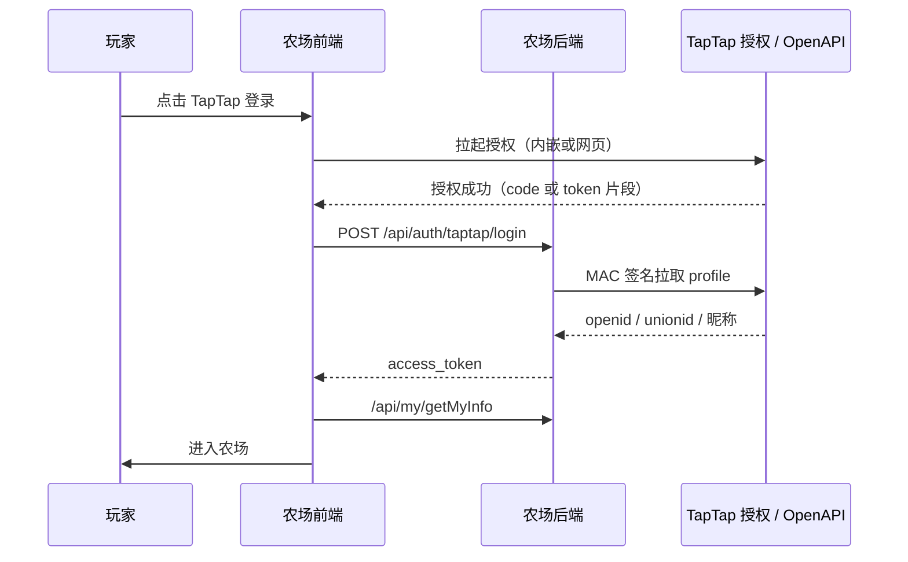

# TapTap 登录接入流程

本文整理《纯文字农场》新增 **TapTap 登录** 需要做的工作、顺序和验收标准。当前只做计划，不改业务代码。

相关官方文档：

- [TapTap 登录功能介绍](https://developer.taptap.cn/docs/sdk/taptap-login/features/)
- [接入 TapTap 登录（推荐：单纯用户认证）](https://developer.taptap.cn/docs/v3/sdk/taptap-login/guide/start/)
- [服务端用 Access Token 换用户信息](https://developer.taptap.cn/docs/sdk/taptap-login/taptap-oauth/)
- [登录按钮设计规范](https://developer.taptap.cn/docs/en/design/)

---

## 1. 目标

在现有登录方式之外增加 TapTap：

| 已有 | 新增 |
| --- | --- |
| 邮箱密码 | TapTap 授权登录 |
| 邮箱验证码 | 设置页绑定 / 解绑 TapTap |
| Web3 钱包 | 同一套游戏账号（`access_token`） |

玩家在 TapTap 内嵌 H5、以及官网 [https://farm.powerct.cn/#/](https://farm.powerct.cn/#/) 都应能用 TapTap 登录（官网可用网页授权 / 扫码，内嵌页优先走容器授权）。

原则与现有 **Web3 登录** 对齐：

1. 前端只拿到一次性授权凭证（code 或 kid + mac_key）。
2. **后端**向 TapTap OpenAPI 校验并取出 `openid` / `unionid`。
3. 后端签发本游戏的 `access_token`，前端照旧写入 `user-token`。
4. `mac_key`、Server Secret、Client Token **不得**写进前端仓库。

---

## 2. 现状（前端）

登录入口在三套 UI 的 `LoginView`（v1 / v2 / v3），模式切换：邮箱登录 / 邮箱验证码 / Web3。

关键文件：

| 文件 | 作用 |
| --- | --- |
| `src/views/v1\|v2\|v3/LoginView.vue` | 登录 Tab |
| `src/components/login/*` | 三种登录表单 |
| `src/stores/user.js` | `login` / `loginEmail` / `web3Login` → 存 token |
| `src/api/user.js` | `/oauth/token`、`/api/auth/email/loginEmail`、`/api/web3/login` |
| `src/views/*/UserSettingView.vue` | 已有绑定邮箱、绑定钱包 |

建议新增一条与 Web3 同级的链路：

```text
点「TapTap 登录」
  → 拉起授权（内嵌 JSBridge 或网页 OAuth）
  → 拿到 kid + mac_key（或 code）
  → POST /api/auth/taptap/login
  → 返回 access_token
  → userStore.setToken + getUserInfo
  → 进农场
```

---

## 3. 推荐方案

游戏 **已有自己的账号体系**，不需要 TDS 内建账户、成就、云存档。采用官方推荐的 **单纯 TapTap 用户认证**。

### 3.1 账号模型

后端为用户增加 TapTap 绑定字段（示例）：

- `taptap_openid`：同一游戏内唯一
- `taptap_unionid`：同一开发者账号下多游戏打通（可选，建议存）
- `taptap_name` / `taptap_avatar`：展示用，可刷新

登录规则：

1. **未绑定**：用 openid 创建或找回农场账号，签发 token（与访客转正、Web3 首次登录同类）。
2. **已绑定**：直接登录该农场账号。
3. **已登录邮箱账号，去设置页绑定**：把当前账号与 openid 绑定；openid 已被别人占用则提示冲突。
4. 不要强制绑定手机号（除非审核或运营要求）。

### 3.2 两种运行环境

本项目同时存在：

1. **TapTap 包体内嵌 WebView**（`npm run pack:taptap` 上传的 zip）
2. **独立站点** `farm.powerct.cn`

| 环境 | 授权方式 | 说明 |
| --- | --- | --- |
| TapTap App 内 H5 | 优先官方 H5 / JSBridge；没有则网页 OAuth | 用户已在 TapTap 登录，体验最好是一键授权 |
| 浏览器打开官网 | 网页 OAuth 或扫码 | 配置 `redirect_uri` 为 `https://farm.powerct.cn/#/login`（Hash 路由需约定 query 落在 hash 内外，见下） |

Hash 路由注意：OAuth 回调常见是 `?code=&state=` 在 **search**，而本项目路由是 `/#/login`。需要二选一：

- 回调落到独立页 `https://farm.powerct.cn/taptap-callback.html`（放 `public/`），再 `location.hash` 跳回应用；或
- 后端中转：`https://api.powerct.cn/api/auth/taptap/callback` 校验后重定向到 `/#/login?taptap=ok`。

**推荐后端中转**，前端不接触 `mac_key`。

### 3.3 服务端校验（必须）

按 [获取用户信息](https://developer.taptap.cn/docs/sdk/taptap-login/taptap-oauth/)：

1. 用 Access Token 的 `kid`、`mac_key` 按 HMAC-SHA1 生成 `Authorization: MAC id=...`。
2. 请求 `GET https://open.tapapis.cn/account/profile/v1?client_id={ClientId}`（或 `basic-info/v1`，取决于 scope）。
3. 得到 openid 后再发本游戏 token。

`kid` / `mac_key` 每次授权都会变，**不是**开发者中心里的 Server Secret。

申请 scope 至少包含 `public_profile` 或 `basic_info` 之一，否则没有 openid。

---

## 4. 工作流程（按顺序）



### 阶段 A：开发者中心配置（产品 / 后台）

1. 打开 [TapTap 开发者中心](https://developer.taptap.cn/) 对应游戏。
2. **游戏服务 → 功能接入 → 开启「TapTap 登录」**。
3. 记录并只放服务端环境变量：
   - Client ID
   - Client Token
   - Server Secret
4. 配置 **Web / H5 回调域名**（`farm.powerct.cn`、`api.powerct.cn`）。
5. 下载 [登录按钮设计资源包](https://developer.taptap.cn/docs/en/design/)，后续 UI 只用官方样式。
6. 确认当前 H5 包体已能在 TapTap 自测页打开（与登录无关，但是联调前提）。

交付：一份内部配置表（不入库）：Client ID、回调 URL、是否已开登录服务。

### 阶段 B：后端接口

与现有 Web3 接口对标，建议：

| 接口 | 方法 | 用途 |
| --- | --- | --- |
| `/api/auth/taptap/login` | POST | 未登录：用授权结果登录/注册 |
| `/api/my/bindTaptap` | POST | 已登录：绑定 |
| `/api/my/unbindTaptap` | POST | 解绑（需已有邮箱或其它登录方式，避免锁死） |
| `/api/auth/taptap/callback` | GET | 可选，网页 OAuth 中转 |

`login` 入参建议二选一（与 Tap 控制台能力对齐后定稿）：

- **授权码模式**：`{ code, redirect_uri, state }`
- **客户端 token 模式**：`{ kid, mac_key, mac_algorithm }`（仅当 H5 SDK 直接给出 token；仍须服务端再验 profile）

处理逻辑：

1. 验签 / 换 token / 拉 profile，失败返回明确错误码（取消授权、过期、签名失败）。
2. 按 openid 查找用户；没有则创建（昵称可用 Tap 昵称，农场名沿用现有默认）。
3. 返回与 `/oauth/token` 相同结构：`access_token`。
4. CORS 允许 `https://farm.powerct.cn` 以及 TapTap 自测域名（按实际 Origin 加白名单）。
5. 日志打 openid 哈希即可，不要打 mac_key。

`getMyInfo` 增加字段例如 `taptap_bound: true/false`、`taptap_name`，供设置页展示。

### 阶段 C：前端

1. **环境变量**（仅公开 Client ID，不要 Secret）  
   - `VITE_TAPTAP_CLIENT_ID`  
   - `VITE_TAPTAP_ENABLED=true`  
2. `src/utils/taptap.js`  
   - 检测是否在 TapTap WebView  
   - `login()`：内嵌走 SDK/JSBridge，否则 `location` 跳转授权 URL  
3. `src/api/user.js` 增加 `taptapLogin` / `bindTaptap`  
4. `src/stores/user.js` 增加 `taptapLogin` action（与 `web3Login` 同样 `setToken` + `getUserInfo`）  
5. `src/components/login/TapTapLogin.vue`  
   - 使用官方按钮图，文案「TapTap 登录」  
   - 处理取消、失败 Toast  
6. 三套 `LoginView.vue` 增加 Tab 或底部独立按钮（规范要求多种登录方式时区分清楚）  
7. 三套 `UserSettingView.vue`「账户安全」增加绑定 TapTap，对标邮箱 / Web3  
8. `src/utils/device.js` 的 `device_type` 可增加 `taptap`（UA 含 TapTap 时），方便后端统计  
9. Hash 回调页（若不用后端中转）：`public/taptap-callback.html`

登录 Tab 建议在 TapTap 内嵌时 **默认选中 TapTap**；官网默认仍可邮箱验证码。

### 阶段 D：账号冲突与安全

- 同一 openid 不可绑两个农场号。  
- 解绑前必须还有邮箱密码或验证码或 Web3，否则拒绝解绑。  
- `state` 防 CSRF；授权 code 一次性。  
- 前端仓库检查：不要再出现类似 `client_secret` 硬编码（现有 OAuth 密码模式已有密钥在 `user.js`，本次不要复制这套做法）。

### 阶段 E：联调与验收

| 场景 | 预期 |
| --- | --- |
| TapTap 自测页，未登录点 TapTap 登录 | 授权后进农场，有 token |
| 用户点取消 | Toast「已取消」，留在登录页 |
| 官网 farm.powerct.cn TapTap 登录 | 跳转授权后回到登录并自动进游戏 |
| 邮箱账号登录后绑定 TapTap | 设置页显示已绑定昵称 |
| 另一邮箱再绑同一 TapTap | 提示已被占用 |
| 仅 TapTap 登录的号解绑 | 不允许或先绑邮箱 |
| iPhone 灵动岛 | 登录页仍有安全区，授权 WebView 关闭后布局正常 |
| `npm run pack:taptap` 新包 | 自测登录成功后再提审 |

### 阶段 F：商店与审核

- 登录页必须有可点的 TapTap 按钮，样式符合 [设计规范](https://developer.taptap.cn/docs/en/design/)，不要改颜色、描边、渐变。  
- 更新 TapTap 商店「更新说明」：新增 TapTap 账号登录。  
- 若审核要求实机录像：录「打开游戏 → 点 TapTap 登录 → 进田地」15 秒。

---

## 5. 前端改动清单（实现时对照）

- [ ] `.env.development` / `.env.production` 增加 `VITE_TAPTAP_*`
- [ ] `src/utils/taptap.js`
- [ ] `src/api/user.js`
- [ ] `src/stores/user.js`
- [ ] `src/components/login/TapTapLogin.vue`
- [ ] `src/views/v1/LoginView.vue`、`v2`、`v3`
- [ ] `src/views/v1/UserSettingView.vue`、`v2`、`v3`
- [ ] `src/utils/device.js`（可选 `taptap`）
- [ ] `public/` 官方按钮切图
- [ ] （可选）`public/taptap-callback.html`

后端（另一仓库，需同步排期）：

- [ ] 用户表字段与迁移
- [ ] login / bind / unbind / callback
- [ ] OpenAPI MAC 验签
- [ ] CORS、错误码文档给前端

---

## 6. 分工建议

| 角色 | 工作 |
| --- | --- |
| 产品 | 确认：能否只绑不强制；解绑规则；默认登录方式 |
| 后台 / 运营 | 开发者中心开服务、填回调、拿密钥给后端 |
| 后端 | 阶段 B、D |
| 前端 | 阶段 C、E 联调、F 按钮与文案 |
| 测试 | 阶段 E 表 |

建议顺序：**中心配置 → 后端 login 可测 → 前端按钮联调 → 绑定/解绑 → 打 H5 包自测 → 提审。**

---

## 7. 风险

- **H5 没有原生 TapSDK**：不能按 Unity/Android 文档直接 `TapLogin.Login()`，必须确认控制台是否提供「网页应用 / H5」OAuth；没有则只能网页跳转授权。  
- **内嵌 WebView 拦截跳转**：授权 URL 打不开时，要向 TapTap 技术支持要内嵌登录 JSBridge。  
- **包体与官网两套 Origin**：CORS 和 redirect_uri 都要配全。  
- **Hash 路由丢 code**：务必用独立 callback 或后端 302，不要指望 `#/login?code=` 一定能收到。

---

## 8. 完成定义

1. TapTap 内、官网浏览器都能用 TapTap 登录进同一套农场号。  
2. 可与邮箱账号绑定，冲突有提示。  
3. 密钥只在服务端；前端只有 Client ID。  
4. 登录按钮为官方素材。  
5. 新 H5 包自测通过，商店更新说明已写。
